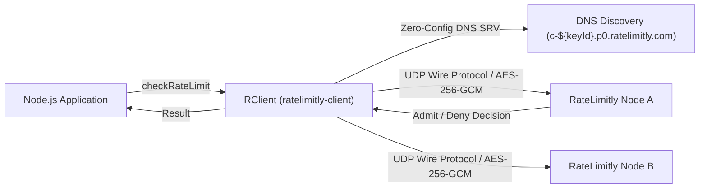

# RateLimitly JavaScript Client (`ratelimitly-client`)

[](https://github.com/ratelimitly-com/rl-js-client/actions/workflows/ci.yml)
[](https://www.npmjs.com/package/ratelimitly-client)
[](https://nodejs.org)
[](package.json)
[](LICENSE)

Official Node.js client library for **RateLimitly** — high-performance, centralized distributed rate limiting and latency-based load shedding over low-latency UDP wire protocol.

---

## Key Highlights

- **⚡ Sub-Millisecond UDP Wire Protocol**: Microsecond-speed binary serialization over UDP without TCP connection overhead or Redis roundtrips.
- **🛡️ Zero Dependencies**: Pure Node.js implementation built strictly on standard library built-ins (`crypto`, `dgram`, `dns`, `events`, `buffer`).
- **🔄 Continuous Sliding Window**: Smooth, real-time distributed admission control without fixed-window boundary burst resets.
- **🔒 AES-256-GCM Encryption & Authentication**: Authenticated Associated Data (AAD) binds clear headers and encrypts PDUs with unique CSPRNG nonces per datagram.
- **🎯 Multi-Resource Atomic Checks**: Evaluate global, tenant, user, and endpoint quotas together in a single atomic network roundtrip.
- **⏱️ Latency Guards & Load Shedding**: Protect downstream databases and microservices by shedding traffic automatically when latency exceeds defined thresholds.
- **🌐 High Availability & DNS Discovery**: Dynamic SRV discovery (`_ratelimitly._udp.<domain>`) and configurable retry gap schedules (fixed, linear, exponential).
- **📘 Full TypeScript Support**: First-class TypeScript declarations (`index.d.ts` and `api_key_codec.d.ts`) included out of the box.

---

## Architecture Overview



---

## Installation

```bash
npm install ratelimitly-client
```

> **Requirements**: Node.js `>= 20.0.0`

---

## Quick Start

```javascript
const { createClient, ResourceRequest } = require('ratelimitly-client');

// 1. Initialize client with your RateLimitly Bech32 API key
// (DNS discovery domain is derived automatically from the key)
const client = createClient(process.env.RATELIMITLY_AUTH_KEY);

// 2. Define resource limit (e.g. 100 requests per 60 seconds)
const resources = [
  new ResourceRequest('api_traffic', 60000, 100, 1)
];

// 3. Check rate limit
client.checkRateLimit(resources, (err, result) => {
  if (err) {
    console.error('Communication error:', err.message);
    return;
  }

  if (result.success) {
    console.log('✅ Request admitted by RateLimitly');
  } else {
    console.log('⛔ Rate limit exceeded! Tokens deficit:', result.resourceResults[0].tokensDeficit);
  }
});
```

---

## Core Features & Usage Patterns

### 1. Multi-Resource Atomic Checks
Evaluate multiple limits in a single datagram. If any quota is exceeded, the request is denied as an atomic unit:

```javascript
const resources = [
  new ResourceRequest('global_traffic', 60000, 10000, 1), // 10,000 req/min
  new ResourceRequest(`user:${userId}`, 1000, 20, 1),       // 20 req/sec
  new ResourceRequest(`org:${orgId}:burst`, 10000, 100, 1)  // 100 req/10s
];

client.checkRateLimit(resources, (err, result) => {
  if (result && result.success) {
    // All quotas passed
  }
});
```

### 2. Latency Guards & Dynamic Load Shedding
Protect downstream services (e.g. databases, external payment APIs) from brownouts:

```javascript
const { LatencyGuard, ServiceLatencyBlock } = require('ratelimitly-client');

const guards = [
  new LatencyGuard({
    latencyTrackerName: 'primary_postgres',
    thresholdMs: 150,       // Max acceptable downstream latency
    ttlMs: 300000,          // Sample window TTL (5 minutes)
    maxSamples: 32,         // Max moving window samples
    minSampleThreshold: 5   // Minimum samples before guard activates
  })
];

client.checkRateLimit(resources, guards, 'checkout.api', async (err, result) => {
  if (!result || !result.success) {
    // Rate limit or latency guard tripped
    return;
  }

  // Execute database query
  const start = Date.now();
  await executeDatabaseQuery();
  const elapsed = Date.now() - start;

  // Asynchronously report downstream latency back to RateLimitly
  client.reportLatency([
    new ServiceLatencyBlock({
      latencyTrackerName: 'primary_postgres',
      observedLatency: elapsed,
      ttlMs: 300000
    })
  ]);
});
```

### 3. Async / Await and Promise Wrapper
Convert callback methods to clean async/await functions:

```javascript
function checkRateLimitAsync(client, resources, guards = [], metricsLabel = null) {
  return new Promise((resolve, reject) => {
    client.checkRateLimit(resources, guards, metricsLabel, (err, result) => {
      if (err) return reject(err);
      resolve(result);
    });
  });
}

// Usage in Express / Fastify / Koa / NestJS:
async function handleRequest(req, res) {
  const result = await checkRateLimitAsync(client, [
    new ResourceRequest(`ip:${req.ip}`, 1000, 10, 1)
  ]);

  if (!result.success) {
    return res.status(429).json({ error: 'Too Many Requests' });
  }

  return res.json({ status: 'ok' });
}
```

### 4. High Availability & Custom Retry Policies
Configure custom retry policies with fixed, linear, or exponential backoff:

```javascript
const { RequestPolicy, HaSchedule, createClient } = require('ratelimitly-client');

const haPolicy = new RequestPolicy({
  unitMs: 20,                                // Base scheduling quantum (ms)
  replayCount: 2,                            // Max replay rounds
  replayGap: HaSchedule.exponential(1, 2, 4), // Exponential growth: 1 -> 2 -> 4 units
  finalReceiveUnits: 1,                      // Tail receive interval
  completionDelivery: true                   // Broadcast result to missing servers
});

const client = createClient(process.env.RATELIMITLY_AUTH_KEY, null, {
  requestPolicy: haPolicy,
  dnsRefreshIntervalS: 300 // DNS SRV refresh interval
});
```

---

## API Reference

### `createClient(authKey, [dnsName], [options])`
Creates and initializes an `RClient` instance.

- **`authKey`** `(string)`: RateLimitly Bech32 API key (`rl-aes1...`, `rl-cookie1...`, `rl-none1...`).
- **`dnsName`** `(string, optional)`: Override tenant discovery domain (defaults to `c-${keyId}.p0.ratelimitly.com`).
- **`options`** `(object, optional)`:
  - `requestPolicy` `(RequestPolicy)`: Custom HA retry/timeout policy.
  - `dnsRefreshIntervalS` `(number)`: DNS SRV cache refresh interval in seconds (default: `300`).
  - `steeringFeedback` `(boolean)`: Enable server port steering affinity (default: `false`).

### `RClient` Methods
- **`checkRateLimit(resources, [guards], [metricsLabel], callback)`**: Evaluates rate quotas and latency guards.
- **`reportLatency(serviceLatencyBlocks, callback)`**: Asynchronously reports observed service latencies.
- **`getServerStats()`**: Returns active server endpoints, stability records, and DNS refresh timestamps.

### `ResourceRequest(bucketName, windowSizeMs, rateLimit, [tokensRequested])`
- **`bucketName`** `(string)`: Logical name or identifier for the rate bucket.
- **`windowSizeMs`** `(number)`: Sliding window length in milliseconds (e.g. `1000`, `60000`).
- **`rateLimit`** `(number)`: Maximum allowed tokens within the window.
- **`tokensRequested`** `(number, default: 1)`: Tokens requested by this operation.

### `LatencyGuard(options)`
- **`latencyTrackerName`** `(string)`: Identifier of the downstream service to track.
- **`thresholdMs`** `(number)`: Maximum allowed latency before shedding requests.
- **`ttlMs`** `(number)`: Expiration TTL for tracked latency samples.
- **`maxSamples`** `(number, default: 32)`: Maximum moving samples.
- **`minSampleThreshold`** `(number, default: 5)`: Minimum samples required before activation.

---

## Bech32 API Key Codec

The library includes a standalone encoder/decoder for RateLimitly's Bech32 key format:

```javascript
const { decodeApiKey, encodeApiKey, bytesToHex } = require('ratelimitly-client/api_key_codec');

const decoded = decodeApiKey('rl-aes1qx2kk...');
console.log({
  authMethod: decoded.authMethod, // 'aes', 'cookie', or 'none'
  keyId: decoded.keyId,           // BigInt (e.g. 4265246494029998997n)
  quotas: decoded.quotas          // Embedded quota limits
});
```

---

## Examples Directory

Explore runnable examples in the [`examples/`](examples/) directory:

- [`01_basic_rate_limiting.js`](examples/01_basic_rate_limiting.js) - Single-resource rate limiting.
- [`02_multi_resource_atomic.js`](examples/02_multi_resource_atomic.js) - Multi-tier atomic rate checks.
- [`03_latency_guards_and_reporting.js`](examples/03_latency_guards_and_reporting.js) - Downstream latency load shedding.
- [`04_promise_async_await.js`](examples/04_promise_async_await.js) - Async/await wrappers.
- [`05_high_availability_policy.js`](examples/05_high_availability_policy.js) - Custom HA retry schedules.
- [`06_api_key_codec.js`](examples/06_api_key_codec.js) - API key encoding and decoding.

---

## Security

Please review [`SECURITY.md`](SECURITY.md) for our threat model, AES-256-GCM authentication details, and vulnerability disclosure process.

---

## Contributing

Contributions are welcome! Please read [`CONTRIBUTING.md`](CONTRIBUTING.md) for development setup and testing instructions.

---

## License

This project is licensed under the [MIT License](LICENSE).
